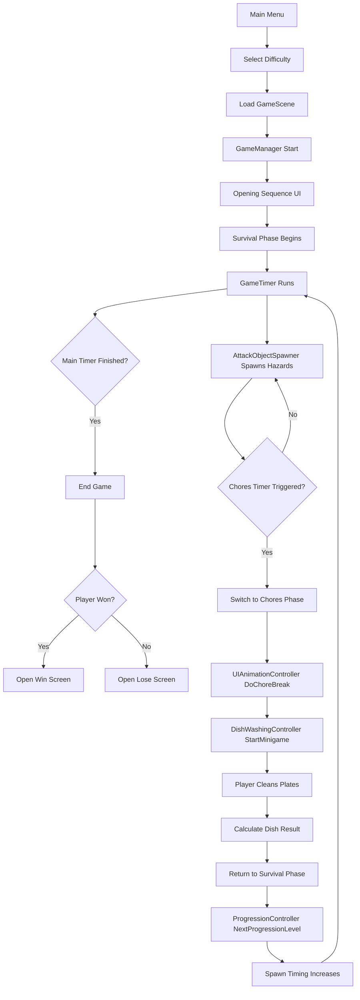

<h1 align="center">🏃 Household Chaos and Chores 🍽️</h1>

A chaotic survival and chores game where you must stay alive in a flying-and-falling-object nightmare while doing chores. The game blends fast-paced survival gameplay with a short dish-washing minigame, where the player alternates between escaping incoming threats and completing household tasks.

## Overview

This project is primarily organized through these corresponding folder roots:

- `Assets/Game Object` contains the player, enemies/attack objects, and the character state system.
- `Assets/Game System` handles the core game loop, progression, timers, and flow control.
- `Assets/Common` contains reusable systems such as audio, saving, camera, and settings.
- `Assets/UI` contains menu screens, HUD, win/lose flows, and UI animation handling.
- `Assets/Scenes` contains the main menu and gameplay scenes.

## Key Features

### 1. Survival Phase
The main gameplay loop is a survival section where the player is active and must avoid incoming attack objects. The phase uses:

- `Player` controller with state-based behavior
- `AttackObjectSpawner` that creates random projectiles/objects over time
- `GameTimer` for overall session timing
- `ProgressionController` that adjusts spawn behavior as the game advances

### 2. Chore Break Minigame
At set intervals, the game pauses the survival phase and launches a dish-washing mini-game:

- The player is temporarily disabled in survival mode
- A chore-break UI sequence plays
- `DishWashingController` spawns plates, tracks remaining dirt, and calculates a result
- The minigame ends with a speed effect based on how clean the plates were

### 3. Difficulty and Progression
The game supports multiple difficulty modes through `ProgressionController`:

- Easy
- Normal
- Hard

Each difficulty selects a different `ProgressionData` asset, which controls:

- Total game time
- Chore break interval range
- Spawn timing ranges for each progression level

## Main Modules and Components

### Game System and Progression

| Component | Purpose | Key Responsibilities |
| --- | --- | --- |
| `GameManager` | Central coordinator for the whole game loop | Connects systems, starts opening sequence, switches survival/chore phases, ends runs, handles pause state |
| `GameTimer` | Controls the main time-based gameplay loop | Tracks the main countdown, chore-break timer, and start/pause/resume timing |
| `ProgressionController` | Applies difficulty and stage scaling | Chooses difficulty data, advances progression levels, updates spawn timings |
| `ProgressionData` | ScriptableObject for tuning balance | Stores game time, chore interval ranges, and per-level spawn timing data |

### Game Objects

| Component | Purpose | Key Responsibilities |
| --- | --- | --- |
| `Player` | Main playable character | Handles input-based movement, state changes, damage logic, and buff behavior |
| `AttackObjectSpawner` | Produces incoming hazards | Spawns randomized attack objects and controls spawn timing |
| `BaseAttackObject` | Shared base for spawned hazards | Defines the common initialization and despawn contract for attack objects |

### Chores System

| Component | Purpose | Key Responsibilities |
| --- | --- | --- |
| `DishWashingController` | Runs the chore minigame | Spawns plates, tracks progress, calculates remaining dirt, and ends the minigame |
| `DishWashingAnimation` | Manages chore UI animation flow | Handles plate appearance/disappearance and minigame visual timing |
| `DishWashingResult` | Displays the result of the chore task | Shows cleanliness results and applies the resulting speed effect |

### Common Systems

| Component | Purpose | Key Responsibilities |
| --- | --- | --- |
| `AudioManager` | Centralized audio system | Plays music and SFX, supports volume/mute settings, and fades music transitions |
| `GameSaveHandler` | Simple save/load utility | Writes and reads persistent JSON save data for game progress |
| `CameraFollow` | Camera behavior | Keeps the camera aligned with the player during gameplay |
| `ParallaxController` / `ParallaxLayer` | Background movement effects | Creates layered parallax motion for the scene |

### UI

| Component | Purpose | Key Responsibilities |
| --- | --- | --- |
| `MainMenuController` | Main menu navigation | Handles menu panels, difficulty selection, scene loading, and quit behavior |
| `PauseScreenController` | Pause screen flow | Opens and closes the pause menu during gameplay |
| `GameoverScreenController` | End-state screen handling | Displays win/lose screens after a run ends |
| `UIAnimationController` | UI animation sequence orchestrator | Runs intro, chore break, win, and lose animations |

## Gameplay Flow

The flow above summarizes the main loop of the game: start from the menu, enter survival, trigger chore breaks at intervals, increase difficulty through progression, and end the run with a win or loss state.

## Additional Info

This project was made by myself using both photographed real-life things and free online assets. This game was submitted to Beyond Game Jam 2026: BiasBreaker.

 
<a href="https://maximillian520.itch.io/household-chaos-and-chores">itch.io</a>
